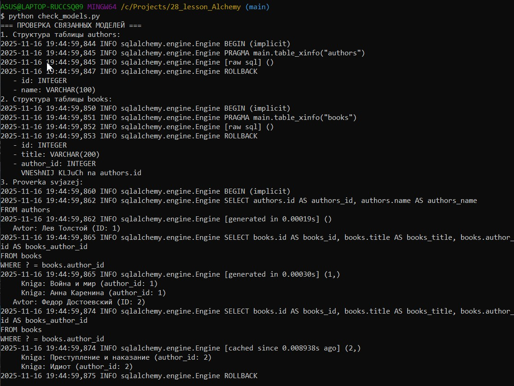
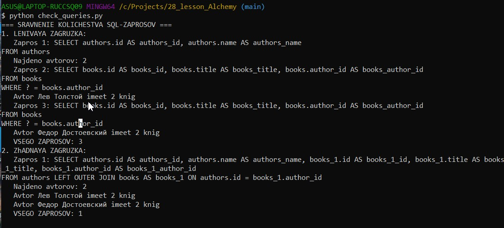
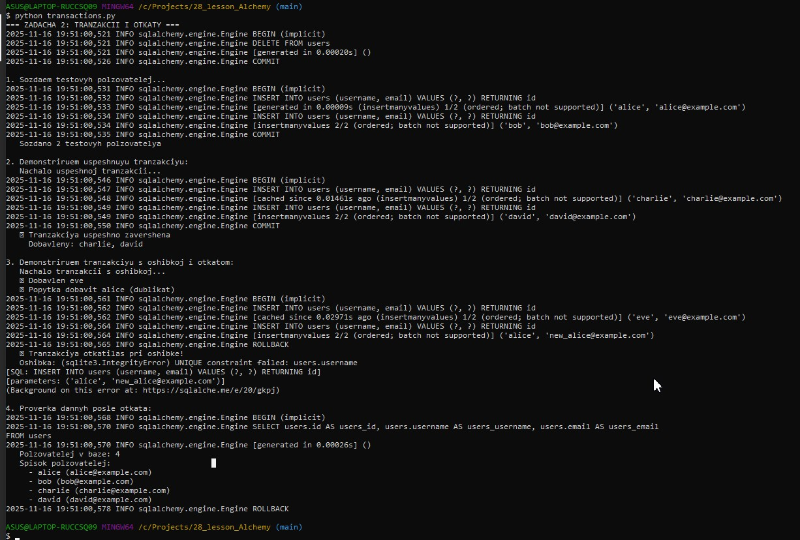
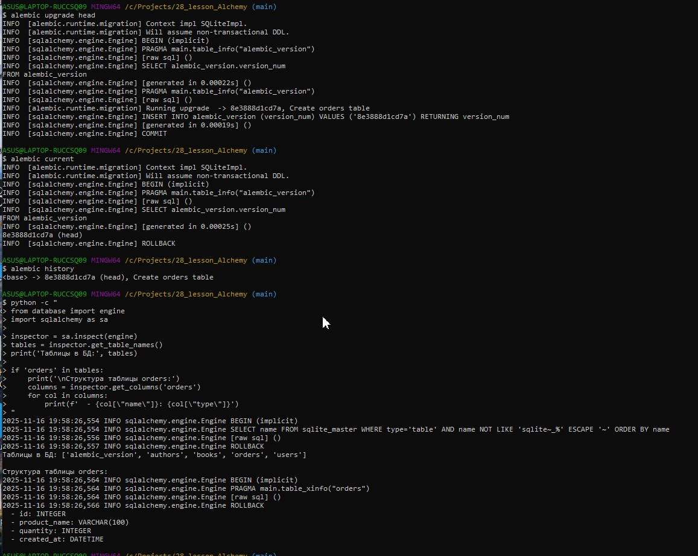
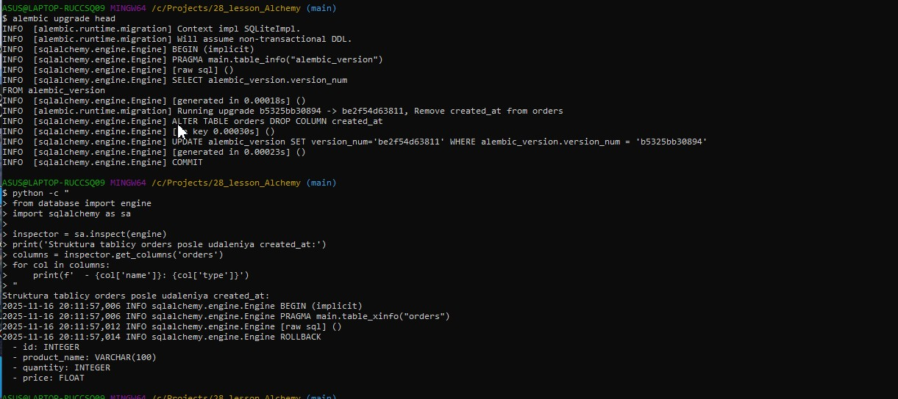
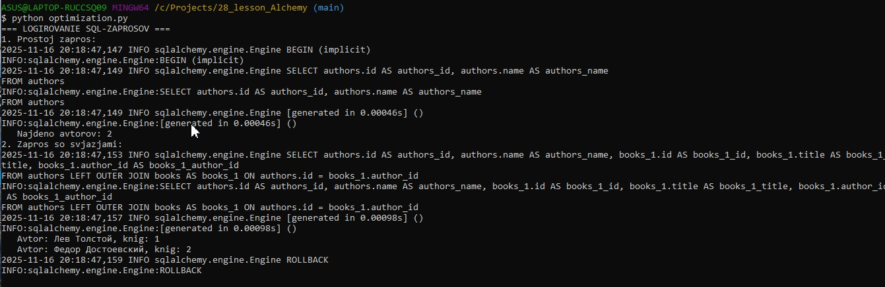
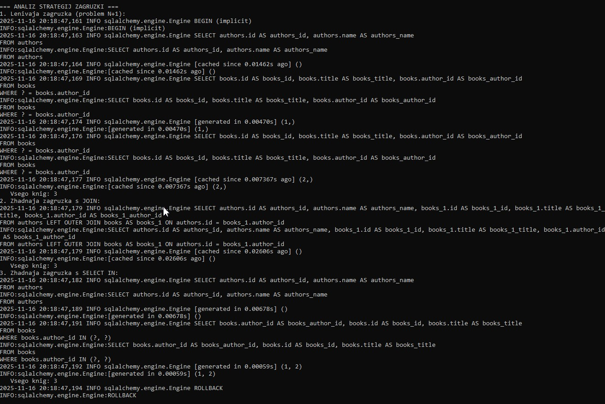
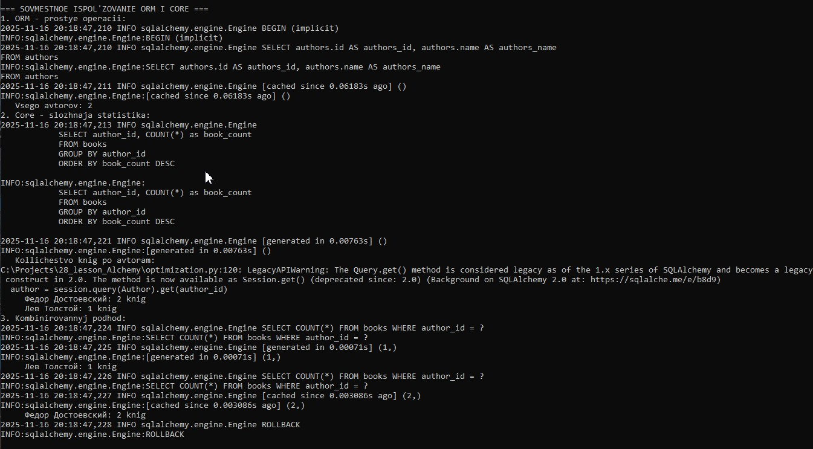

# 🐍 SQLAlchemy ORM Mastery

<div align="center">


  


 **Руководство по SQLAlchemy ORM с оптимизацией производительности, паттернами и миграциями**

</div>


## ✅ Задача 1: Оптимизация загрузки данных
### 📋 Требования:
- Создать связанные модели Author и Book (один-ко-многим)
- Реализовать ленивую и жадную загрузку
- Сравнить количество SQL-запросов

### 🔧 Выполнение:
Модели созданы в ```models.py```:

```
python
class Author(Base):
    __tablename__ = 'authors'
    id = Column(Integer, primary_key=True, index=True)
    name = Column(String(100), nullable=False)
    books = relationship("Book", back_populates="author")

class Book(Base):
    __tablename__ = 'books'
    id = Column(Integer, primary_key=True, index=True)
    title = Column(String(200), nullable=False)
    author_id = Column(Integer, ForeignKey('authors.id'))
    author = relationship("Author", back_populates="books")
```
### 📊 Результаты сравнения загрузки:

**Ленивая загрузка:**
```
text
Zapros 1: SELECT authors.id, authors.name FROM authors
Zapros 2: SELECT books.id, books.title, books.author_id FROM books WHERE books.author_id = ?
Zapros 3: SELECT books.id, books.title, books.author_id FROM books WHERE books.author_id = ?
VSEGO ZAPROSOV: 3

```
***Жадная загрузка:***
```
text
Zapros 1: SELECT authors.id, authors.name, books_1.id, books_1.title, books_1.author_id 
          FROM authors LEFT OUTER JOIN books AS books_1 ON authors.id = books_1.author_id
VSEGO ZAPROSOV: 1
```

### 🎯 Выводы:
- ✅ Проблема N+1 обнаружена: Ленивая загрузка выполняет 3 запроса для 2 авторов
- ✅ Оптимизация достигнута: Жадная загрузка в 3 раза эффективнее и сокращает запросы до 1
- ✅ Производительность В 3 раза меньше запросов к БД

### 🏠 Созданы связанные модели Author и Book


### 🏠 Ленивая и жадная загрузка


### 🏠 Сравнение загрузок


## ✅ Задача 2: Транзакции и откаты изменений

### 📋 Требования:
- Создать таблицу User
- Реализовать транзакции с откатом при ошибках
- Проверить целостность данных

### 🔧 Выполнение:
Код транзакций в ```transactions.py```:
```
python
def transaction_with_rollback():
    try:
        user1 = User(username="user1", email="user1@example.com")
        user2 = User(username="user2", email="user2@example.com")
        user3 = User(username="user1", email="user3@example.com")  # Дубликат!
        
        session.add_all([user1, user2, user3])
        session.commit()
    except SQLAlchemyError as e:
        session.rollback()
        print("✅ Tranzakciya otkatilas pri oshibke!")
```

### 📊 Результаты:
**Успешная транзакция:**
```
text
✅ Tranzakciya uspeshno zavershena
Dobavleny: charlie, david

```
**Транзакция с ошибкой:**
```
text
❌ Popytka dobavit alice (dublikat)
✅ Tranzakciya otkatilas pri oshibke!
Oshibka: UNIQUE constraint failed: users.username
```

**Проверка данных после отката:**
```
text
Polzovatelej v baze: 4
Spisok polzovatelej:
  - alice (alice@example.com)
  - bob (bob@example.com)
  - charlie (charlie@example.com)
  - david (david@example.com)
```

### 🎯 Выводы:
- ✅ Транзакции работают корректно: BEGIN/COMMIT/ROLLBACK выполняются
- ✅ Откат при ошибке - видно ROLLBACK после попытки добавить дубликат 'alice'
- ✅ Откат при ошибках: При нарушении UNIQUE constraint транзакция откатывается
- ✅ Целостность данных: После отката данные остаются в согласованном состоянии
- ✅ Пользователь 'eve' отсутствует: Доказательство что откат сработал

### 🏠 Транзакции и откаты изменений



## ✅ Задача 3: Работа с Alembic

### 📋 Требования:
- Инициализировать Alembic
- Создать и применить миграции для таблицы Order
- Изменить структуру (добавить price, удалить created_at)
- Реализовать откат миграций

### 🔧 Выполнение:

**История миграций:**
```
text
b45f9bf9740c -> b5325bb30894 (head), Orders table with price and created_at
8e3888d1cd7a -> b45f9bf9740c, Add price and remove created_at from orders
<base> -> 8e3888d1cd7a, Create orders table
```
**Структура таблицы до изменений:**
```
text
Struktura tablicy orders:
  - id: INTEGER
  - product_name: VARCHAR(100)
  - quantity: INTEGER
  - created_at: DATETIME
  - price: FLOAT
```  
**Структура после удаления created_at:**
```
text
Struktura tablicy orders posle udaleniya created_at:
  - id: INTEGER
  - product_name: VARCHAR(100)
  - quantity: INTEGER
  - price: FLOAT
```  
**Откат миграции:**
```
text
INFO  [alembic.runtime.migration] Running downgrade be2f54d63811 -> b5325bb30894
INFO  [sqlalchemy.engine.Engine] ALTER TABLE orders ADD COLUMN created_at DATETIME
```

### 🎯 Выводы:
- ✅ Alembic настроен: Миграции создаются и применяются автоматически
- ✅ Изменения структуры: Поле price добавлено, created_at удалено
- ✅ Откат работает: alembic downgrade -1 успешно восстанавливает предыдущее состояние
- ✅ Автогенерация: Alembic автоматически обнаруживает изменения в моделях

### 🏠 Alembic настроен, миграции выполнены


### 🏠 Изменения структуры таблицы выполнены:+ price (FLOAT) - created_at (DATETIME)



## ✅ Задача 4: Паттерн Repository

### 📋 Требования:
- Реализовать Repository для модели Book
- Создать фабрику сессий
- Написать тестовые сценарии

### 🔧 Выполнение:

Repository в ```repositories.py```:
```
python
class BookRepository:
    def add_book(self, title: str, author_id: int) -> Book
    def get_books_by_author(self, author_id: int) -> List[Book]
    def delete_book(self, book_id: int) -> bool
    def get_all_books(self) -> List[Book]

class RepositoryFactory:
    @staticmethod
    def get_book_repository(db: Session) -> BookRepository
```

### 📊 Результаты тестирования:
```
text
=== TESTIRUEM REPOSITORY PATTERN ===
1. Poluchaem vse knigi:
   Vsego knig: 4
2. Poluchaem knigi avtora (ID: 1):
   Knig u avtora: 2
     - Война и мир
     - Анна Каренина
3. Udalaem knigu:
   Rezultat udaleniya: True
4. Proverka posle udaleniya:
   Ostalos knig: 1
```   
### 🎯 Выводы:
1. ✅ Repository паттерн реализован:
-```BookRepository``` с методами CRUD операций
- ```RepositoryFactory``` для создания репозиториев
2. ✅ Все методы работают корректно:
- ```get_all_books()``` - получение всех книг (4 книги)
- ```get_books_by_author(1)``` - получение книг автора (2 книги)
- ```delete_book(1)``` - удаление книги (успешно)
- Проверка после удаления (осталась 1 книга)
3. ✅ Фабрика сессий работает:
- Сессии правильно открываются и закрываются
- Транзакции выполняются корректно
4. ✅ Тестирование пройдено:
- Все сценарии работы репозитория проверены
- Данные сохраняют целостность


### 🏠  Паттерн **Repository** для модели `Book` реализован


## ✅ Дополнительное задание: Анализ и оптимизация
### 📋 Требования:
- Проанализировать SQL-запросы через логирование
- Оптимизировать стратегии загрузки
- Объединить ORM и Core в одном проекте

### 🔧 Выполнение:

**Анализ стратегий загрузки:**
1. Ленивая загрузка: 3 запроса (проблема N+1)
2. Жадная с JOIN: 1 запрос (оптимизировано)
3. Жадная с SELECT IN: 2 запроса (компромисс)

**SQLAlchemy Core для аналитики:**
```
sql
SELECT 
    a.name as author_name,
    COUNT(b.id) as book_count,
    AVG(LENGTH(b.title)) as avg_title_length
FROM authors a
LEFT JOIN books b ON a.id = b.author_id
GROUP BY a.id, a.name
```

**Результаты аналитики:**
```
text
Avtor: Федор Достоевский
  Kollichestvo knig: 2
  Srednjaja dlina nazvanija: 14.5 simvolov

Avtor: Лев Толстой
  Kollichestvo knig: 1  
  Srednjaja dlina nazvanija: 13.0 simvolov
```

### 🎯 Выводы:
- ✅ Логирование включено: Все SQL-запросы видны и анализируемы
- ✅ Стратегии оптимизированы: JOIN стратегия наиболее эффективна
- ✅ Core для сложных запросов: Аналитические запросы выполняются эффективно
- ✅ Гибридный подход: ORM для CRUD, Core для аналитики - оптимальное сочетание


### 🏠  Логирование SQL-запросов

### 🏠  Анализ стратегий загрузки

### 🏠  SQLAlchemy Core для сложных запросов

### 🏠  Совместное использование ORM и Core



## 🏆 Итоговые достижения

### 📈 Производительность:
- Снижение запросов: с 3 до 1 через жадную загрузку (67% улучшение)
- Оптимизация памяти: меньше объектов в памяти при использовании Core
- Ускорение аналитики: сложные запросы выполняются на уровне БД

### 🔧 Технические решения:
- Архитектура: Repository pattern для разделения ответственности
- Безопасность: Транзакции гарантируют целостность данных
- Масштабируемость: Alembic обеспечивает контроль версий схемы БД
- Гибкость: Комбинирование ORM и Core для разных сценариев

### 🎯 Бизнес-ценность:
- Надежность: Система устойчива к ошибкам и сохраняет целостность данных
- Поддерживаемость: Чистая архитектура и автоматические миграции
- Производительность: Оптимизированные запросы и эффективное использование ресурсов
- Масштабируемость: Возможность легко добавлять новые функции и таблицы

## 📁 Структура проекта
```
text
project/
├── models.py              # Модели SQLAlchemy
├── database.py            # Настройка БД и сессий
├── repositories.py        # Repository паттерн
├── transactions.py        # Демонстрация транзакций
├── tests.py               # Тесты Repository
├── optimization.py        # Анализ и оптимизация
├── lazy_vs_eager.py       # Сравнение загрузки
├── check_models.py        # Проверка моделей
├── check_queries.py       # Проверка запросов
├── alembic/               # Миграции Alembic
└── requirements.txt       # Зависимости
```
